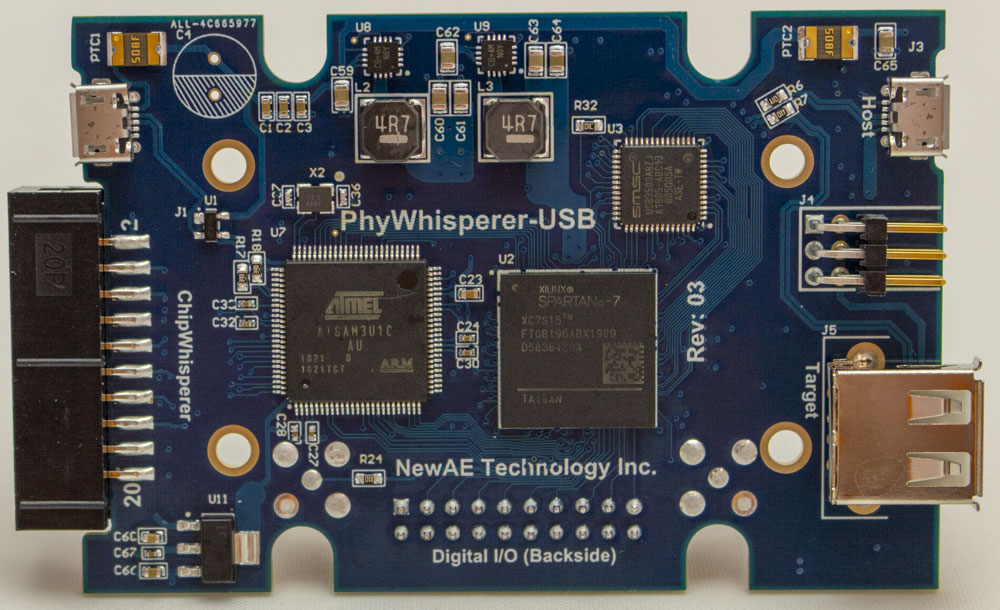
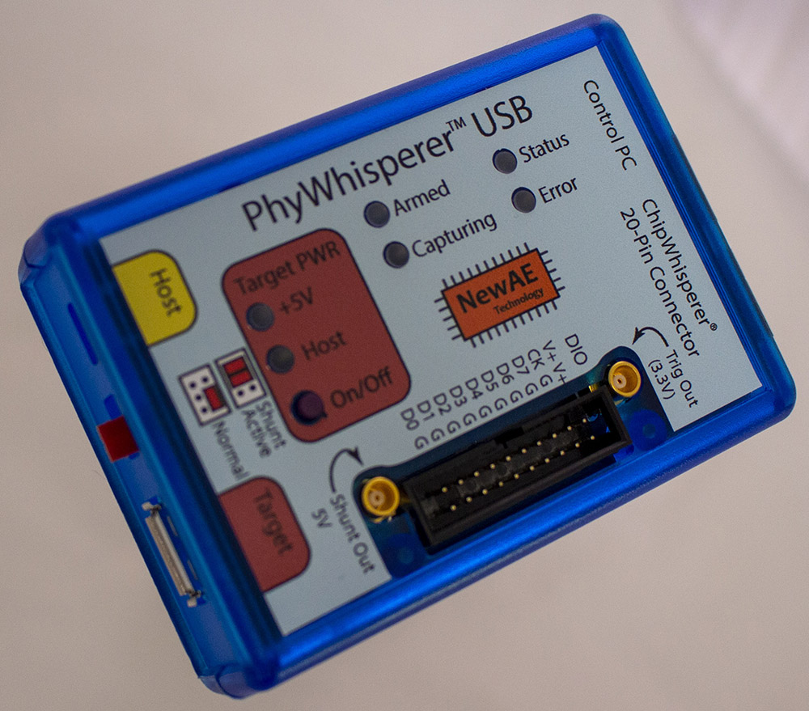

# PhyWhisperer-USB

What is this thing? This is a hardware trigger for FI or SCA, which triggers on the USB phy.

## Get a PhyWhisperer-USB

Check out https://www.crowdsupply.com/newae/phywhisperer-usb for the Crowd Supply!

## Photos

## Status

The current PCB (-04) is the final design released to manufacture, and software is considered mostly stable.

## Comparison to Other Projects

What is PhyWhisperer & why does it exist? Other related solutions:

* TotalPhase Beagle 480 - Closed source but *extremely nice* solution, primarily a USB sniffer/analyzer but can perform hardware triggering.

* OpenVizsla - Open source, USB sniffer w/ FPGA. Could add trigger logic onto this FPGA, but is missing the ability to cycle target power.

* GreatFET w/ GlitchKit - Open source using a micro firmware for USB trigger.

* FaceWhisperer - Open source using a SPI-based PHY chip.

PhyWhisperer-USB primarily closely integrates the FPGA with the triggering based on USB line data. This allows you to generate more complex glitch waveforms - the actual USB triggering will be no better than a Beagle 480, but the advantage is the PhyWhisperer-USB can be directly connected to other open and closed-source tools (such as ChipWhisperer, ChipSHOUTER, or a signal generator). Rather than a single trigger at the exact moment (such as Beagle 480) you can adjust the offset & width of the trigger signal. This offset/width adjustment is required to sweep a glitch that is triggered from PhyWhisperer.

The PhyWhisperer-USB adds features a glitch-master would find useful, such as an ability to power-cycle the target device, and perform power measurements across USB (plausible simple SPA attacks could work, mostly useful to see what state target is in).

Compared to GreatFET or FaceWhisperer this tool cannot perform tasks such as fuzzing or complex state machines (which are relatively easy with those tools).

Basic USB sniffing capability exists in this tool, as it's useful when deciding on the effect your glitch is having. If you require a more robust USB analyzer the TotalPhase Beagle 480 comes highly recommended by Colin (no connection - he just really likes them).

