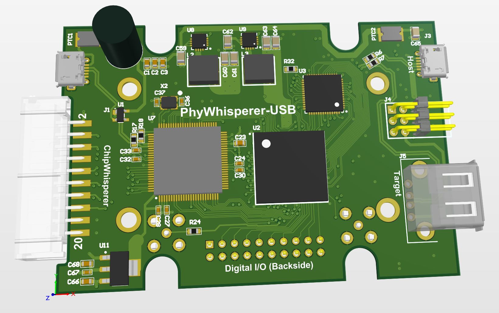

# PhyWhisperer-USB

What is this thing? This is a hardware trigger for FI or SCA, which triggers on the USB phy.

## Status

This is totally untested so far and incomplete. You can poke at the schematic if you'd like, proto boards are in order.

## Comparison to Other Projects

What is PhyWhisperer & why does it exist? Other related solutions:

* TotalPhase Beagle 480 - Closed source but *extremely nice* solution, primarily a USB sniffer/analyzer but can perform hardware triggering.

* GreatFET w/ GlitchKit - Open source using a micro firmware for USB trigger.

* FaceWhisperer - Open source using a SPI-based PHY chip.

PhyWhisperer-USB primarily closely integrates the FPGA with the triggering based on USB line data. This allows you to generate more complex glitch waveforms - the actual USB triggering will be no better than a Beagle 480, but the advantage is the PhyWhisperer-USB can be directly connected to other open and closed-source tools (such as ChipWhisperer, ChipSHOUTER, or a signal generator). Rather than a single trigger at the exact moment (such as Beagle 480) you can adjust the offset & width of the trigger signal. This offset/width adjustment is required to sweep a glitch that is triggered from PhyWhisperer.

Compared to GreatFET or FaceWhisperer this tool cannot perform tasks such as fuzzing or complex state machines (which are relatively easy with those tools).

The PhyWhisperer hardware could be used as a USB analyzer or logic analyzer, but the software/firmware/fpga does not support this (and no plans to add such functionality). If you require a USB analyzer the TotalPhase Beagle 480 comes highly recommended by Colin (no connection - he just really likes them).

